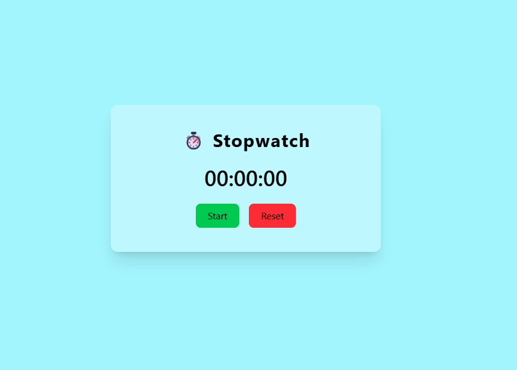
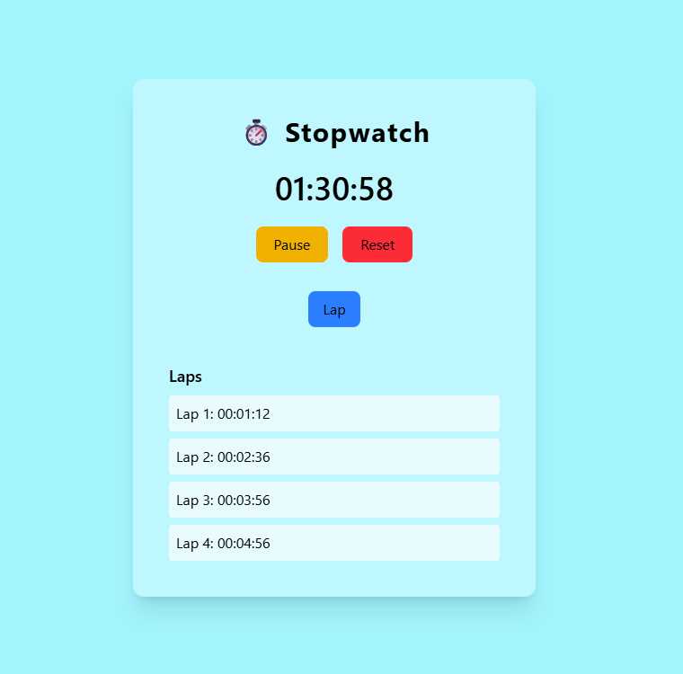

# Stop Watch

A simple React application to track elapsed time with start, stop, reset, and lap functionality.

## Table of Contents

- [Features](#features)
- [Installation](#installation)
- [Usage](#usage)
- [Screenshots](#screenshots)
- [Contributing](#contributing)
- [License](#license)
- [Acknowledgements](#acknowledgements)

## Features

- Start, stop, and reset the stopwatch
- Record lap times
- Responsive UI
- Easy to use

## Installation

1. Clone the repository:
    ```bash
    git clone https://github.com/Geekykiran/stop-watch-react-app.git
    ```
2. Navigate to the project directory:
    ```bash
    cd stop-watch-react-app
    ```
3. Install dependencies:
    ```bash
    npm install
    ```

## Usage

Start the development server:
```bash
npm run dev
```
Open [http://localhost:3000](http://localhost:3000) to view it in your browser.

## Screenshots




## Contributing

Contributions are welcome! Please open issues or submit pull requests for improvements.

## License

This project is licensed under the [MIT License](LICENSE).

## Acknowledgements

- [React](https://react.dev/)
- [Vite](https://vite.dev/guide/)
